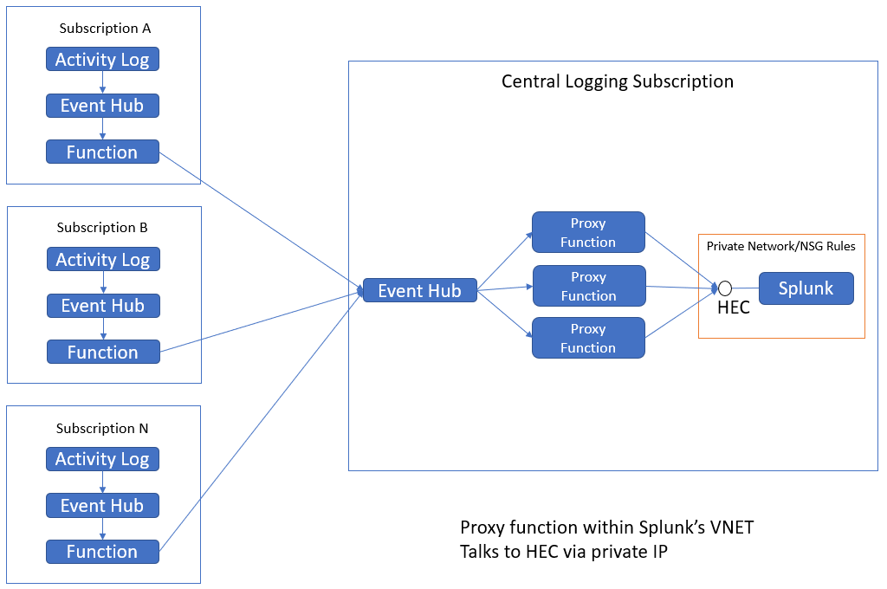

# Azure Function for Splunk --> .NET Proxy --> Splunk HEC

The generalized architecture for Splunk includes a cluster of indexers. If using the HEC, the indexers can follow a load balancer. When monitoring a large Azure environment, it's likely that many subscriptions will be monitored by a central Splunk cluster. The proxy function allows the indexer LB to be hidden in a private network. Since the proxy is configured to be triggered by an event hub (and has no other endpoints), it's a hard target.

## Configuration Details

Environment Variables

| Parameter Name |  Type  |  Value  |  Notes  |
|----------------|-------|-------|------|
| AzureWebJobsScriptRoot   | string | /home/site/wwwroot |  |
| AzureWebJobsStorage      | string | \<storage account connection string\> | required |
| hubConnection | string | \<event hub connection string \> | telemetry from Azure Function for Splunk instances |
| input-hub-name           | string | collector-to-proxy | matches configuration of collector function |
| FUNCTIONS_WORKER_RUNTIME | string | dotnet             | required |
| splunkAddress | string | https://whatever:8088/services/collector | HEC address or LB address |
| splunkToken | string | HEC splunk auth token | |
| splunkCertThumbprint | string | thumbprint of CA cert | |
| CA_PRIVATE_KEY_PASSWORD | string | password | usually provide in docker run |
| CA_CERT_FILENAME | string | splunk_cacert.pfx | combine cert & key |

## SSL encryption for calls to HEC  

If splunkAddress starts with https, a certificate in pfx format must be provided in the /site/ca-certificates folder. The first time the function runs, it will load that certificate into the CurrentUser Root certificate store. This repo provides splunk_cacert.pfx generated from the default CA cert & key that Splunk provides with their installation files. To use your own cert, edit the splunkCertThumbprint, CA_PRIVATE_KEY_PASSWORD, and CA_CERT_FILENAME values in the environment.  

The provided pfx was created with this command:  

`openssl pkcs12 -export -out splunk_cacert.pfx -in splunk_cacert.pem -inkey splunk_cacert_key.pem`

The private key password for splunk_cacert_key.pem is 'password'.

